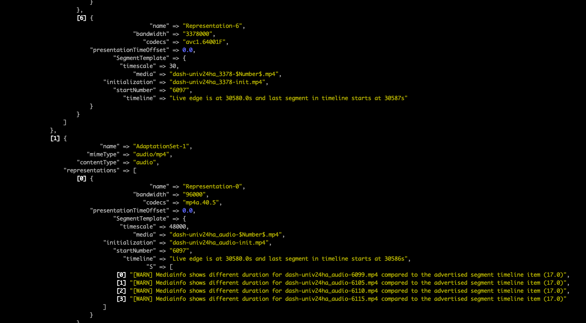

# Dash Timeline Validator

This tool allows you to validate your [MPEG Dash](https://en.wikipedia.org/wiki/Dynamic_Adaptive_Streaming_over_HTTP) manifest to find if there are errors related to the presentation timeline model.



## Docker Usage

```
docker run -e VERIFY_SEGMENTS_DURATION=false --rm -it anafrombr/dash_timeline_validator https://storage.googleapis.com/shaka-live-assets/player-source.mpd
```

## Installation

Add this line to your application's Gemfile:

```ruby
gem 'dash_timeline_validator'
```

And then execute:

    $ bundle

Or install it yourself as:

    $ gem install dash_timeline_validator

## Usage

Run this program passing the manifest path.

```
dash_timeline_validator https://storage.googleapis.com/shaka-live-assets/player-source.mpd
```

### Options

- `ACCEPTABLE_DRIFT *(default 2)*` - the minimum duration drift acceptable between the sequential segments
- `DEFAULT_PRESENTATION_DELAY *(default 10)*` - the delay in seconds of the live edge
- `BUFFERED_SEGMENTS *(default 2)*` - the number of segments buffered by the player to generate the live edge
- `VERIFY_SEGMENTS_DURATION *(default false)*` - check the duration of every segment when setted to `true` (warn: this will download every segment of the manifest)
- `ANALYZER_FOLDER *(default "data/[HASH]")*` - folder used to download the files
- `ANALYZER_MANIFEST_PATH *(default "#{ANALYZER_FOLDER}/manifest.mpd")*` - manifest path


## Development

After checking out the repo, run `bin/setup` to install dependencies. Then, run `rake spec` to run the tests. You can also run `bin/console` for an interactive prompt that will allow you to experiment.

To install this gem onto your local machine, run `bundle exec rake install`. To release a new version, update the version number in `version.rb`, and then run `bundle exec rake release`, which will create a git tag for the version, push git commits and tags, and push the `.gem` file to [rubygems.org](https://rubygems.org).

## Contributing

Bug reports and pull requests are welcome on GitHub at https://github.com/globocom/dash_timeline_validator.
